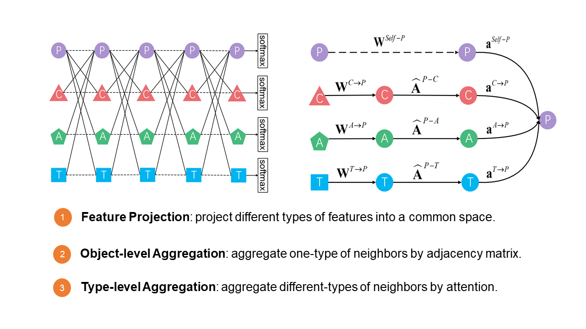

# ie-HGCN
This is the source code of our paper published in IEEE TKDE 2021 paper: Interpretable and Efficient Heterogeneous Graph Convolutional Network.

IEEE Xplore: <https://ieeexplore.ieee.org/document/9508875>

Pre-print version: <https://arxiv.org/abs/2005.13183>




<center>Model architecture</center>


## Datasets
The original dataset of **IMDB** is downloaded from [HetRec 2011](https://grouplens.org/datasets/hetrec-2011/)

The original datasets of **ACM** and **DBLP** are provided by the authors of [\[WWW 2019\] \[HAN\] Heterogeneous Graph Attention Network](https://doi.org/10.1145/3308558.3313562)

The preprocessed dataset are too large to be posted on GitHub. You can download **preprocessed dataset** and **preprocessing script** from the following links:

Baidu cloud drive: [https://pan.baidu.com/s/1uTqp2H9a0bQImcjEE3HUjw](https://pan.baidu.com/s/1uTqp2H9a0bQImcjEE3HUjw), extraction code *"dqbc"*.

OneDrive cloud drive: [https://tinyurl.com/tkde-hgcn](https://tinyurl.com/tkde-hgcn).

We also provide a concise version of source code in both of the two above cloud drives.

Please feel free to E-mail me <ymyang@stu.xidian.edu.cn> if you cannot download them successfully.


## Requirements
- [PyTorch](https://pytorch.org)
- [NumPy](https://numpy.org)
- [scikit-learn](https://scikit-learn.org)


## Reference
If you make advantage of ie-HGCN in your research, please kindly cite our work as follows:

```
@article{yang2021interpretable,
  title={Interpretable and efficient heterogeneous graph convolutional network},
  author={Yang, Yaming and Guan, Ziyu and Li, Jianxin and Zhao, Wei and Cui, Jiangtao and Wang, Quan},
  journal={IEEE Transactions on Knowledge and Data Engineering},
  year={2021},
  publisher={IEEE}
}
```
